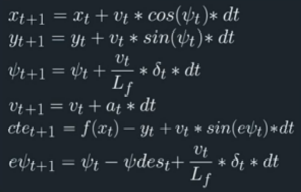
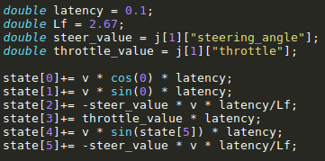

## Model Description

Model Predictive control is an advanced control algortihm used to control a dynamic process. It takes state description or model equations, variable constraints and past state value as input and gives process control inputs as output. MPC tries to minimize a cost function using optimization techniques like interior point optimization to give best possible process control inputs.
For my project - 

**1. State**  
It consists of -  
a. x - vehicle's x position   
b. y - vehicle's y position  
c. psi - vehicle's orientation  
d. v - velocity  
e. cte - cross track error   
f. epsi - error in the orientation  
All the above state variables are in vehicle's coordinate.  
  
The simulator sends the data according to the map coordinates. We converted it to the vehicle's coordinate system.    
Vehicle's coordinate system -   
x - vehicle's heading  
y - vehicle's right side
  
**2. Model/Update Equations**  
Following are the equations used to formulate the vehicle's model.  
  

Lf is the distance from the COG of the vehicle to the front axle.  
These equations are also used as constraint equations.
  
**3. Actuator Inputs**  
a. delta - steering angle, constrained - {-25, 25}(values in degrees)  
b. a - acceleration(throttle) value, constrained - {-1,1}(values is SI units)  
  
**4. Cost Function**  
I included the following paramters in the cost function.  
a. cte  
b. epsi  
c. deviation from the reference velocity  
d. delta  
e. acceleration  
f. change in delta over a single timestep  
g. change in acceleration over a single timestep  
  
 

## Timestep(N)

Timestep defines the number of coordinate points that the MPC will predict into the future which are used to define a curve that the vehicle will follow. But using high value for N is futile, as MPC re-evaluates the trajectory after every actuation. So, I used N = 10.

## DT

DT denotes the time difference between the consecutive timesteps. I used dt = 0.01.

## Tuning N and DT

Initially I kept the reference velocity as 50mph. For that I used N = 25 and dt = 0.1. But that resulted in huge deviation and disturbance. I believe it is mostly because of the environment at 50mph was changing fast and horizon that I used for it was large.  
Then, I change N from 25 -> 10 and dt to 0.05. These values helped MPC in adapting to the changing environment fast which is required at high speed.  
Finally, for reference velocity of 80mph, i used the following parameters -  
N, dt - {10, 0.01}  
The value of dt for 80mph is less than 50mph because of increased randomness of the environment.

## Latency

In real world, there will always be some latency because of the prediction and actuation processes. To simulate this in my project, I used the following equations -   
  

